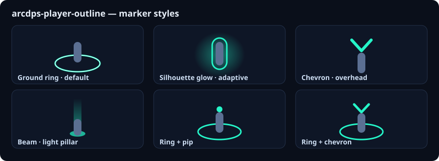

# arcdps-player-outline

[](https://github.com/darkharasho/arcdps-player-outline/actions/workflows/release.yml)

An [arcdps](https://www.deltaconnected.com/arcdps/) plugin for **Guild Wars 2** that draws a persistent, always-on-top marker on **your own character** — so you can instantly find yourself in a crowded zerg. It reads your position from **MumbleLink** and projects it to screen space, tracking smoothly at any camera angle.

It marks *only you*. It does **not** outline other players/NPCs and does **not** show distance to the commander tag (see [Scope & limitations](#scope--limitations)).



<!-- In-game captures: drop your PNGs in docs/images/ and uncomment:


-->

## Features

- **6 marker styles** — projected ground ring (default; a true floor circle that reads as a circle overhead and an ellipse from the side), adaptive silhouette glow, overhead chevron, light beam, ring + pip, ring + chevron.
- **Smooth tracking** — [One Euro](https://gery.casiez.net/1euro/) filtering (calm at rest, responsive when moving) with torn-read protection.
- **Configurable outline** — a contrasting border around every element (e.g. blue fill + white outline) so it stays legible on any background.
- **Per-mode toggle** — show the marker in PvE, WvW, or both; structured PvP is always off.
- **Fit height to race** — auto-sizes head-anchored styles to your character's race (so the chevron sits above a Norn's head, not their chest), with an editable per-race height table and a manual nudge.
- **Distance fade** — eases the marker down when the camera is zoomed in close (solo), full when zoomed out (in a pile).
- **Off-screen arrow** — a screen-edge arrow points to you when the camera is turned away.
- **Live config** — full options panel (color, opacity, per-style sliders) with settings saved to an ini next to the DLL.
- **Cross-platform** — a native Windows DLL that also runs under **Proton/Wine** on Linux.

## Install

You need **arcdps** already installed for GW2. Then:

1. Get `arcdps_player_outline.dll` (build it — see [Building](#building-from-source) — or grab a release if available).
2. Copy it into your GW2 **`addons/`** folder — the same folder that holds your other `arcdps_*.dll` plugins, e.g.:
   - **Windows:** `...\Guild Wars 2\addons\`
   - **Linux/Proton (Steam):** `.../steamapps/common/Guild Wars 2/addons/`
3. **Fully restart** Guild Wars 2 (arcdps loads plugins at launch — a map change won't pick it up).

Open the config with the arcdps options hotkey (default **Alt+Shift+T**) → **Extensions** → **player_outline**.

> **ImGui version must match arcdps.** arcdps silently ignores a plugin whose ImGui version differs from its own. This build vendors ImGui **1.92.7** (`IMGUI_VERSION_NUM 19270`). If a future arcdps update changes ImGui and the marker stops drawing, re-vendor the matching version and rebuild (see below).

### Linux/Proton quick deploy

If you build from source on Linux, `scripts/deploy.sh` copies the DLL into the GW2 addons folder atomically:

```bash
./scripts/deploy.sh
# or point it elsewhere:
PLAYER_OUTLINE_DEPLOY_DEST="/path/to/Guild Wars 2/addons/arcdps_player_outline.dll" ./scripts/deploy.sh
```

## Usage

In the options panel:

- **Show self marker** — master toggle.
- **Style** — pick from the six styles; each exposes its own size/shape sliders.
- **Color / Opacity** and **Outline** (color + width) — set e.g. a blue marker with a white outline.
- **Behavior** — distance fade (near/far in meters) and the off-screen arrow.

Everything applies live; settings persist to `arcdps_player_outline.ini` on exit.

## Building from source

The project cross-compiles a Windows x64 DLL from Linux with **MinGW-w64**, and builds a **native** test binary for the platform-independent core (math, projection, filtering, MumbleLink parsing).

**Requirements:** `cmake` (≥ 3.20), `x86_64-w64-mingw32-g++` (MinGW-w64), a host C++17 compiler, `curl` (first build vendors ImGui + doctest).

```bash
# --- native unit tests (host g++) ---
cmake -S . -B build-native
cmake --build build-native
./build-native/core_tests

# --- Windows plugin DLL (MinGW cross-compile) ---
cmake -S . -B build-win -DCMAKE_TOOLCHAIN_FILE=cmake/mingw-w64-x86_64.cmake
cmake --build build-win
# -> build-win/arcdps_player_outline.dll
```

A native Windows build (MSVC/clang-cl) is also possible — the code is standard C++17 + Win32; only the `cmake/mingw-w64-x86_64.cmake` toolchain file is Linux-specific.

## How it works

- **MumbleLink** provides your avatar position, camera position/front/up, and FoV. The plugin reads GW2's live MumbleLink block by scanning its own address space (`VirtualQuery`) — this is required under Proton, where GW2 doesn't expose the block via the named object to an in-process reader. It also creates + holds the named `MumbleLink` section at init so **native Windows** GW2 populates it.
- The pure **core** (`src/core/`) builds a left-handed view/projection from the MumbleLink camera (using the game's real camera-up to avoid gimbal-lock when looking straight down) and projects your world position to screen space. This part is unit-tested.
- The **plugin** (`src/plugin/`) smooths the projected point, then draws the selected marker via arcdps's shared ImGui context.

## Scope & limitations

- **Self only.** MumbleLink exposes *your* character and camera — nothing about other players. There is no safe (non-memory-reading) API for another player's live world position, so **distance/direction to the commander tag is not possible** in a live overlay. (arcdps only records other players' positions into combat *logs*, after the fact.)
- **Not a true 3D outline.** These are overlay markers, not a shader outline of your character model. A real see-through silhouette would require DX11 render-pipeline work (pixel isolation), which is intentionally out of scope.
- **Windows standalone path is untested by the author** (developed/verified under Proton). It follows the documented MumbleLink contract; if the marker doesn't appear on native Windows, that's the first thing to check.

## Credits

- Visual inspiration: the Minecraft [Player-Outline](https://github.com/neilrush/Player-Outline) mod (neilrush).
- Built on [arcdps](https://www.deltaconnected.com/arcdps/) and [Dear ImGui](https://github.com/ocornut/imgui).
- MumbleLink-on-Linux insight from reading how sibling tools locate the block via `/proc`.

## License

[MIT](LICENSE) © 2026 darkharasho.

Vendored dependencies keep their own licenses: [Dear ImGui](https://github.com/ocornut/imgui) (MIT) and [doctest](https://github.com/doctest/doctest) (MIT), both under `third_party/`.
